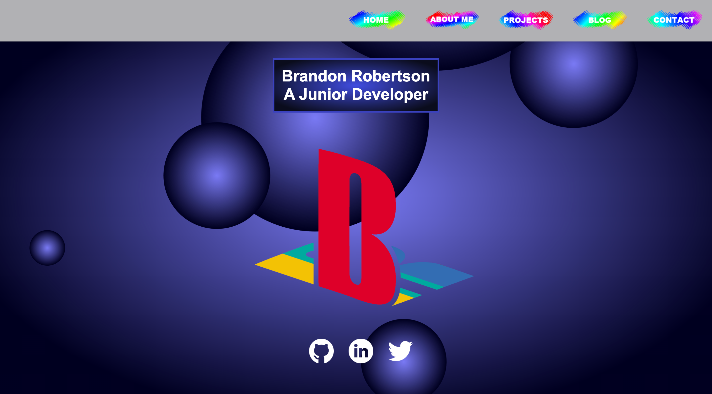
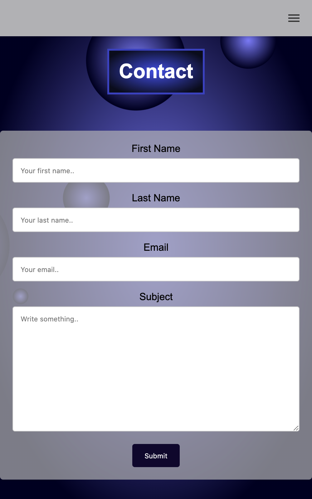

https://brandonrobertson23.github.io/t1a3/src/html/index.html

https://github.com/brandonrobertson23/t1a3

Description of your portfolio website, including,
    Purpose
    Functionality / features
    Sitemap
    Screenshots
    Target audience
    Tech stack (e.g. html, css, deployment platform, etc)

The purpose of my portfolio website is to get me hired as a junior developer while also showing of my #gamer personality, lifestyle and aesthetics to my potential employers.

The portfolio features a homepage that contains links to my social medias, an about me page that explains a little about me, a projects page that shows previous projects I have worked on, a blog page so i can put up blog posts about my life and a contact page that has a standard contact form for contacting me (not working yet).

Wireframe

The Sitemap

Screenshots

The target audience for my site would be anyone interested in my life, my projects that i'm involved in or hiring me to work for/with them.

To build this site I used HTML for the content, CSS for the styling, layout and animations and i deployed it using GitHub Pages, originally I was going to use Netlify but I couldn't get it working with the folder structure required plus with GitHub I can host the powerpoint presentation and readme.md file.