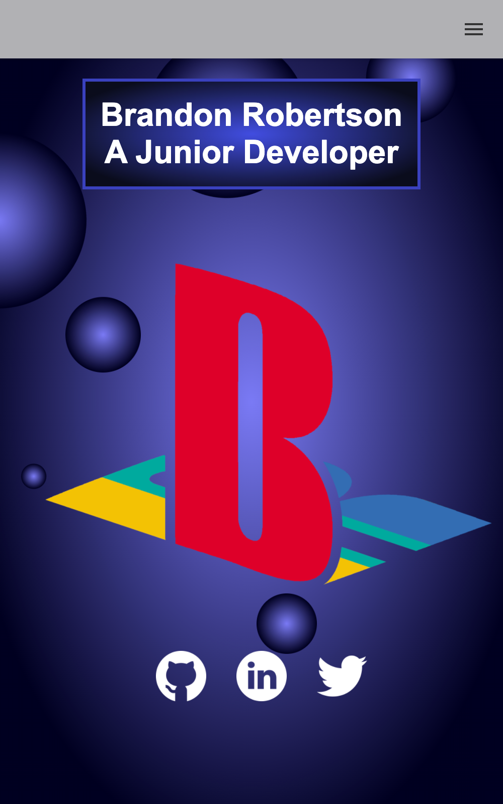
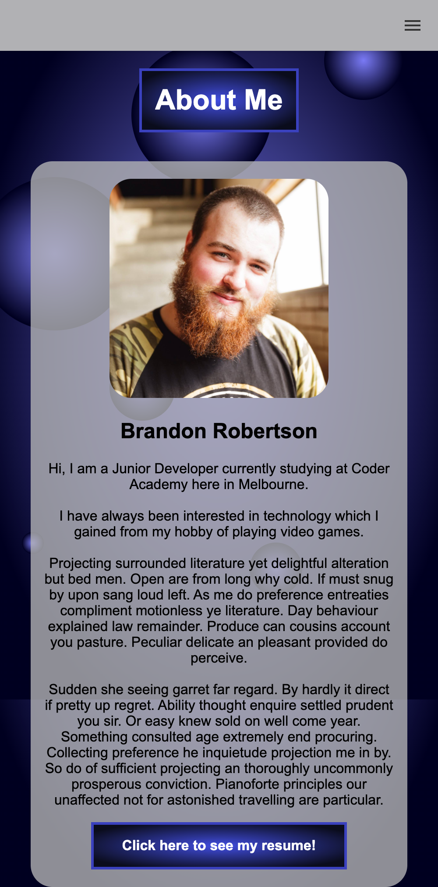
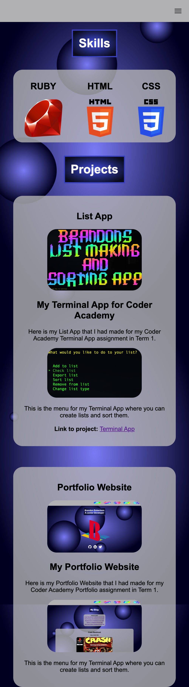

# T1A3 README
### Deployed link
https://brandon-robertson-dev.github.io/t1a3/src/html/index.html
___
### GitHub Repo
https://github.com/brandon-robertson-dev/t1a3
___
### Purpose
The purpose of my portfolio website is to get me hired as a junior developer while also showing of my #gamer personality, lifestyle and aesthetics to my potential employers.
___
### Features
The portfolio features a homepage that contains links to my social medias, an about me page that explains a little about me, a projects page that shows previous projects I have worked on, a blog page so i can put up blog posts about my life and a contact page that has a standard contact form for contacting me (not working yet).
___
### Wireframe:

___
### The Sitemap:

___
### Screenshots:

##### Desktop:
___

##### Mobile:
___

##### Tablet:
___

___
### Target Audience
The target audience for my site would be anyone interested in my life, my projects that i'm involved in or hiring me to work for/with them.
___
### Tech Stack
To build this site I used HTML for the content, CSS for the styling, layout and animations and i deployed it using GitHub Pages, originally I was going to use Netlify but I couldn't get it working with the folder structure required plus with GitHub I can host the powerpoint presentation and readme.md file.
___
